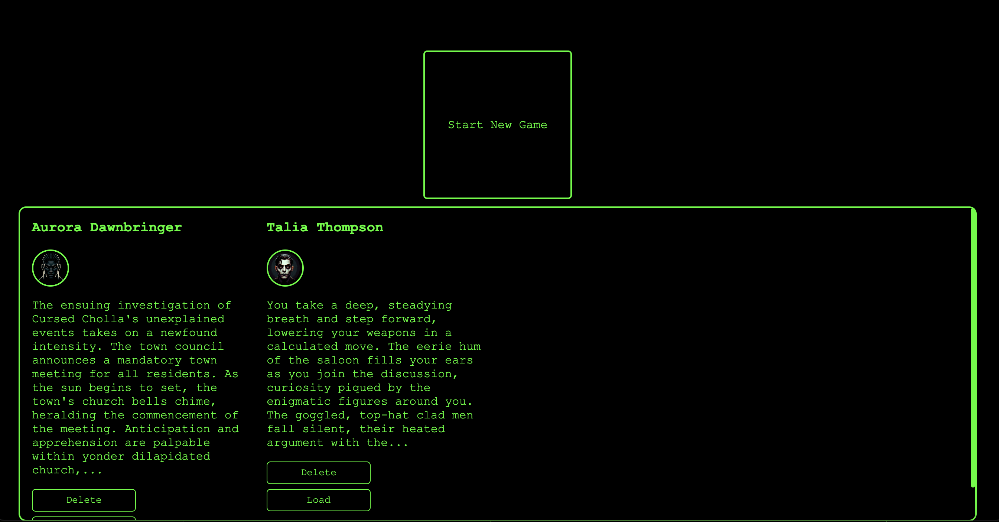
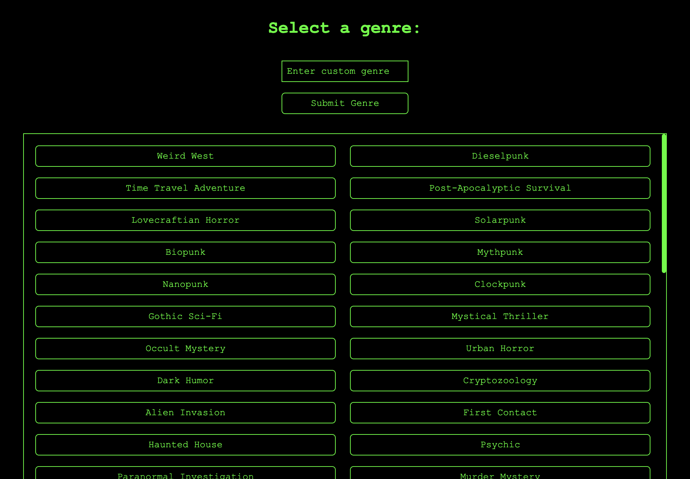
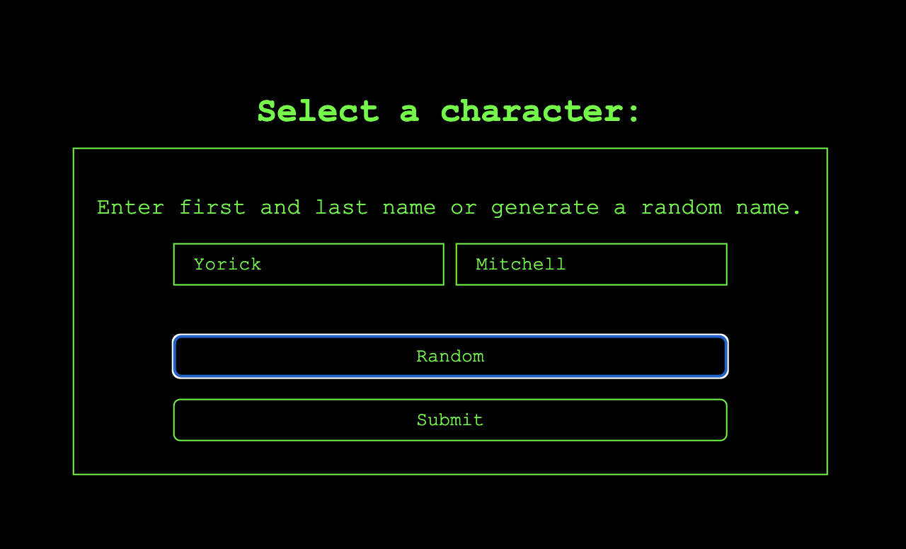
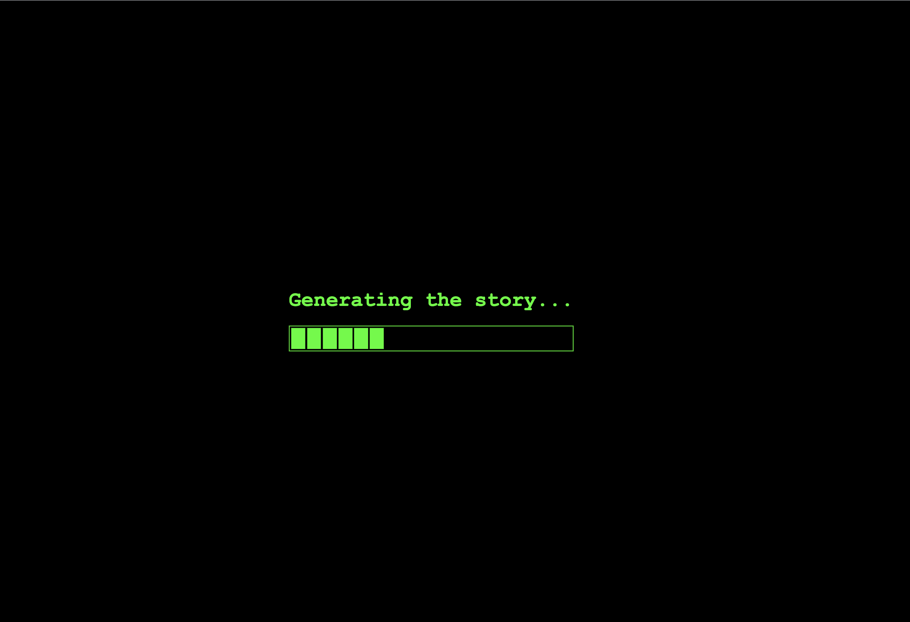
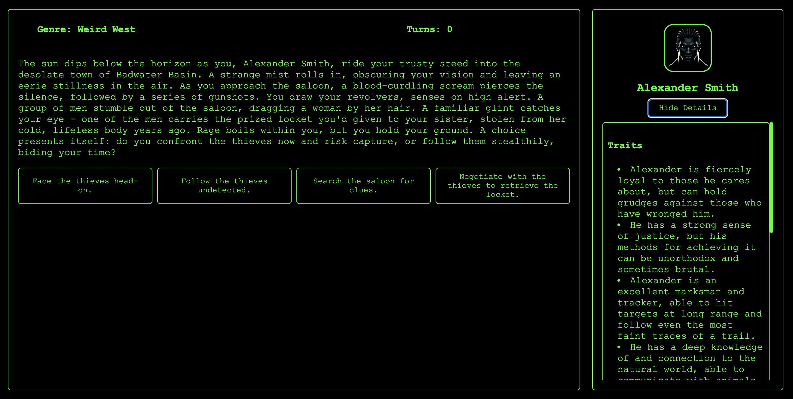
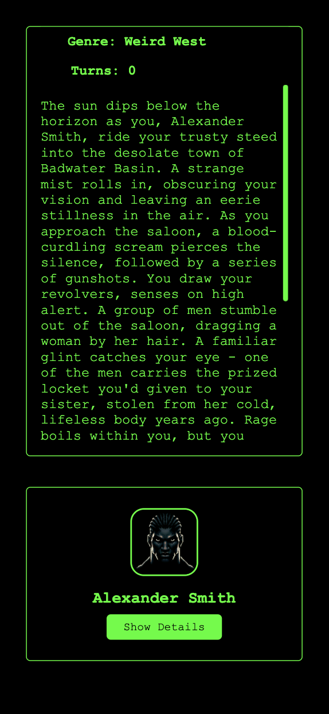

# Nous Text Adventures

  

  <a href="README.md">English</a> | 
  <a href="README_KR.md">한국어</a>

Nous Text Adventures (NTA) is an interactive, procedurally generated text adventure game powered by the Nous API, originated from MyTextAdventure. Choose your favorite genre and dive into an immersive world created just for you! Advanced prompt engineering ensures that Nous LLM responses are intelligently formatted and integrated into your unique adventure.

> **Note on Future Airdrops**: While this is purely hypothetical at this stage, if Nous decides to allocate airdrops for community projects in the future, we plan to distribute them fairly among game users based on their gameplay history, engagement quality, and contribution to the ecosystem. Illegal actors will be excluded from future airdrop if there is one.

## Table of Contents

- [Features](#features)
- [Installation](#installation)
- [Usage](#usage)
- [License](#license)

## Features

- Interactive, procedurally generated text adventures based on players previous decision and state
- Choose from multiple genres
- Powered by Nous API
- Advanced prompt engineering for intelligent LLM responses
- React, TypeScript, and CSS-based responsive design
- Added more various situations, moral decisions and player quirk based choices
- Added score system, more endings

## Screenshots

  
  
  
  
  
  

