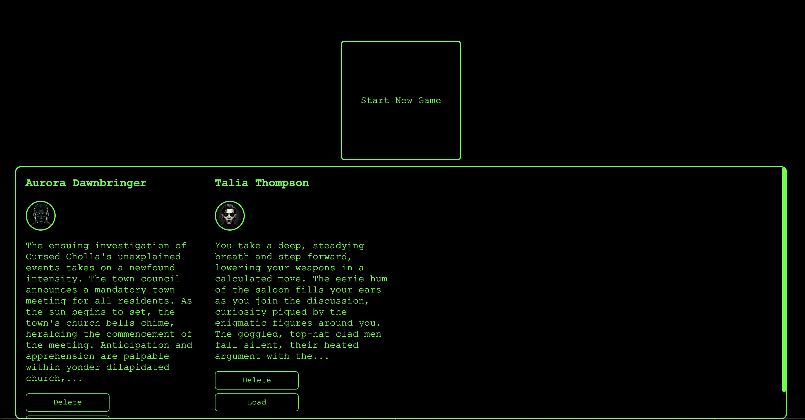

# Nous Text Adventures

  

  <a href="README.md">English</a> | 
  <a href="README_KR.md">한국어</a>

Nous 텍스트 어드벤처(NTA)는 Nous API를 기반으로 하는 인터랙티브한 절차적 생성 텍스트 어드벤처 게임으로, MyTextAdventure에서 발전되었습니다. 좋아하는 장르를 선택하고 당신만을 위해 만들어진 몰입감 있는 세계로 뛰어들어보세요! 고급 프롬프트 엔지니어링을 통해 지능적으로 포맷된 Nous LLM 응답이 당신만의 고유한 모험에 통합됩니다.

> **향후 에어드랍에 관한 참고사항**: (현 단계에서는 가정에 불과하지만) 만약 Nous가 향후 커뮤니티 프로젝트에 에어드랍을 배정한다면, 게임 이용자들의 플레이 내역, 참여 품질, 프로젝트 기여도 등을 기준으로 공정하게 분배할 계획입니다. 부정 사용자는 향후 에어드랍이 존재한다면 대상에서 제외됩니다.

## 목차

- [기능](#기능)
- [설치](#설치)
- [사용법](#사용법)
- [라이선스](#라이선스)

## 기능

- 플레이어의 이전 결정과 상태를 기반으로 한 인터랙티브한 절차적 생성 텍스트 어드벤처
- 다양한 장르 선택 가능
- Nous API 기반 작동
- 지능형 LLM 응답을 위한 고급 프롬프트 엔지니어링
- React, TypeScript 및 CSS 기반의 반응형 디자인
- 다양한 상황, 도덕적 결정, 플레이어 특성 기반 선택지 추가
- 점수 시스템 및 다양한 엔딩 추가

## 스크린샷

  
  
  
  
  
  

